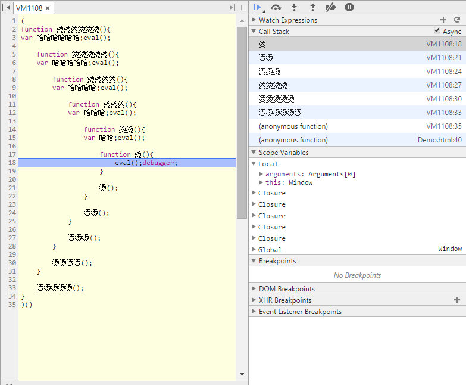

Interception - A simple demo on how JavaScript closures work
============

In this demo, I create a function which looks like this:
```js
function 烫烫烫(){
var 哈哈哈;eval();

	function 烫烫(){
	var 哈哈;eval();
	
		function 烫(){
			eval();debugger;
		}

		烫();
	}

	烫烫();
}
```

Basically, this is achieved by repeating following steps(Recursion)
```
function [level]
  var local_variable[level]
    function [level+1]
```

And the deepest function will trigger the breakpoint by calling
```js
debugger;
```

If you use Chrome, you will see this
;

Then you can inspect each of the callstack in DevTools and see
- Local variables
- Global variables
- **Closure variables**

Have fun!
